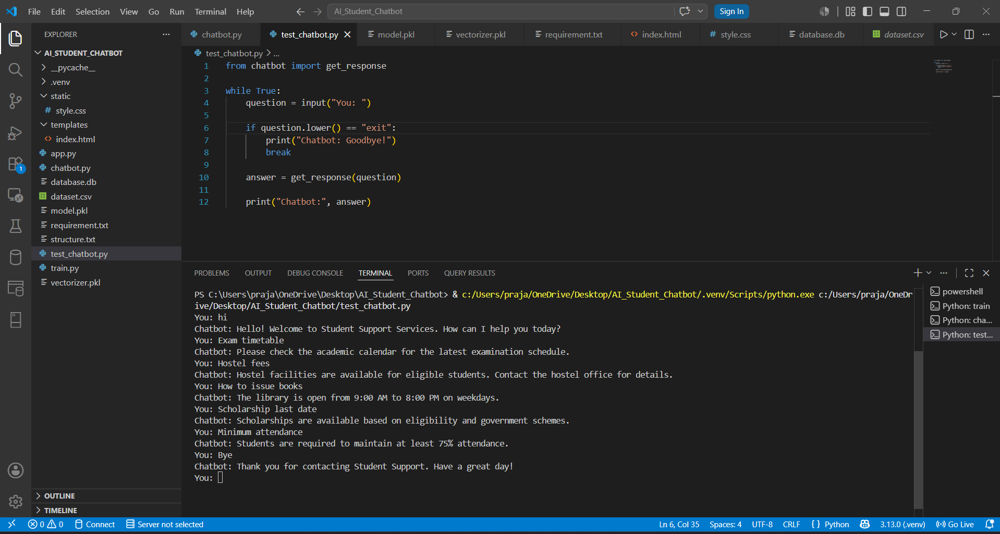

# AI Chatbot for Student Support Services using Python and Machine Learning

The AI Chatbot for Student Support Services is an intelligent virtual assistant that helps students by answering frequently asked questions related to academics, admissions, fees, examinations, placements, library, hostel, scholarships, and college events.

Instead of waiting for office hours or contacting staff, students can ask questions at any time through the chatbot. The chatbot understands user questions using Natural Language Processing (NLP) and provides relevant responses instantly.

This project reduces the workload of college staff while improving student support.

## Chatbot Features
- Ask questions in simple English.
- Understand different ways of asking the same question.
- Answer frequently asked student questions
- Intent prediction using Machine Learning
- Greeting messages.
- Thank you and goodbye responses.
- Handle unknown questions politely.

## Technologies Used

- Python
- Flask
- HTML
- CSS
- SQLite
- Pandas
- NumPy
- Scikit-learn
- NLTK
- Joblib

## Project Structure

```
AI-Student-Chatbot/
│
├── app.py
├── chatbot.py
├── train.py
├── dataset.csv
├── model.pkl
├── vectorizer.pkl
├── requirements.txt
├── README.md
├── database.db
│
├── templates/
│   └── index.html
│
├── static/
│   └── style.css
```

---
## About Dataset
The dataset includes:
✅ Question
✅ Intent
✅ Response
✅ Around 300 balanced rows

Includes intents such as:
- Greeting
- Goodbye
- Admission
- Fees
- Hostel
- Plus additional sample intents to increase training data.
## Installation

### 1. Clone the repository

```bash
git clone https://github.com/your-username/StudentChatbot.git
```

### 2. Open the project

```bash
cd StudentChatbot
```

### 3. Create a virtual environment

Windows

```bash
python -m venv venv
venv\Scripts\activate
```

Linux/macOS

```bash
python3 -m venv venv
source venv/bin/activate
```

### 4. Install dependencies

```bash
pip install -r requirements.txt
```

---

## Training the Model

Run the following command:

```bash
python train.py
```

This will generate:

- model.pkl
- vectorizer.pkl

---

## Running the Project

Start the Flask server:

```bash
python app.py
```

Open your browser:

```
http://127.0.0.1:5000
```

---

---

## Machine Learning Algorithm

The chatbot uses:

- TF-IDF Vectorizer
- Multinomial Naive Bayes Classifier

---

## Workflow

```
User Question
      │
      ▼
Text Preprocessing
      │
      ▼
TF-IDF Vectorization
      │
      ▼
Machine Learning Model
      │
      ▼
Intent Prediction
      │
      ▼
Retrieve Response
      │
      ▼
Display Response
```

---

## Working of Chatbot

```
Student types a question
          │
          ▼
     chatbot.py
          │
          ▼
Load model.pkl
          │
          ▼
Load vectorizer.pkl
          │
          ▼
Convert text into numbers
          │
          ▼
Predict intent
          │
          ▼
Search dataset.csv
          │
          ▼
Return matching response
```
---
## Database Schema
### chat_history
| Column    | Type      |
| --------- | --------- |
| id        | INTEGER   |
| question  | TEXT      |
| response  | TEXT      |
| date_time | TIMESTAMP |


## Database Workflow

```
   Student
     │
     ▼
   Flask
     │
     ▼
chatbot.py
     │
     ▼
Predict Intent
     │
     ▼
Generate Response
     │
     ▼
Save Question + Response
     │
     ▼
SQLite Database
```
---
## Chatbot Interface


